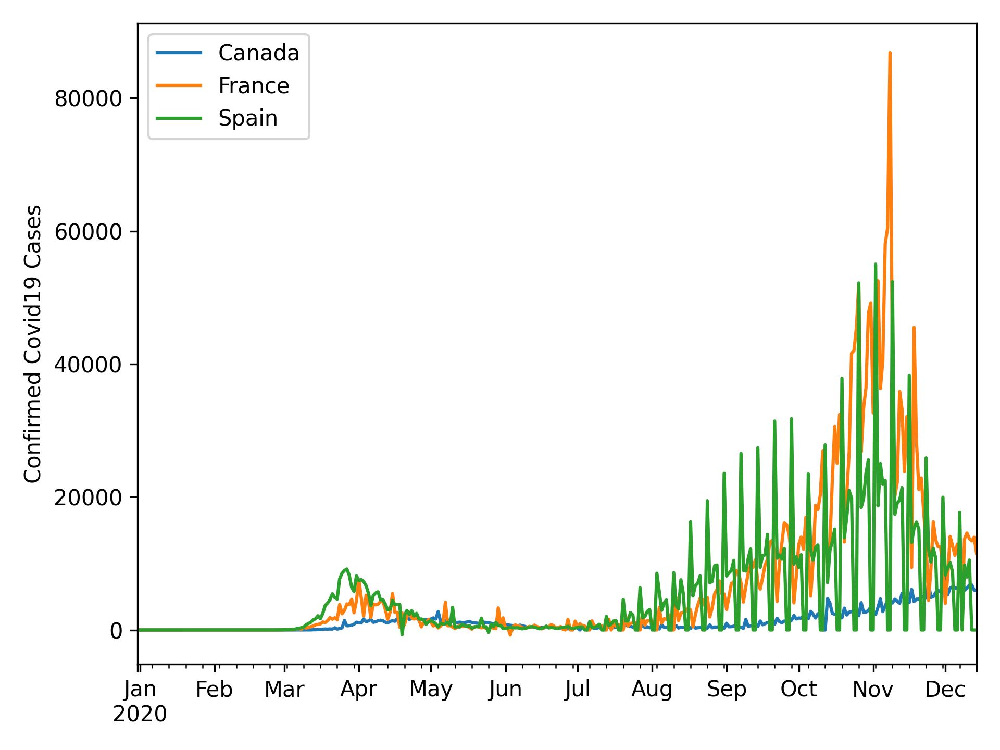

# covpy 

A package for getting daily covid19 confirmed cases and death from the [ECDC](https://www.ecdc.europa.eu/en). See this [example](https://github.com/pearsedoolin/covpy/blob/master/covpy_example.ipynb) to get started.

## Installation

Use `pip install covpy`

## Example Usage

```python3
import covpy
import matplotlib.pyplot as plt

dataCollector = covpy.DataCollector()

cases = dataCollector.get_covid19_cases()
countries = ['Canada', 'France', 'Spain']
ax = cases[countries].plot()
ax.set_ylabel("Confirmed Covid19 Cases")
plt.show()
```

And this will create the following graph

